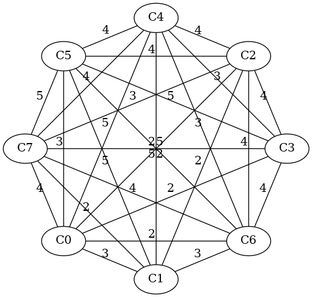

# Cuprins

1. [Implementarea Ant Colony Optimization pentru TSP](#1-implementarea-ant-colony-optimization-pentru-tsp)
2. [Implementarea algoritmului MOO pentru TSP](2#-implementarea-algoritmului-moo-pentru-tsp)

## 1. Implementarea Ant Colony Optimization pentru TSP
#### Autor: Vlad Bartolomei
Plecăm cu cercetarea noastră de la o implementare deja existentă a ACO, care poate fi găsită la următorul link:   

- [Ant Colony Optimization Algorithm for TSP-OPTIMIZE in Haskell](https://bitbucket.org/rickdzekman/ant-colony-optimization-algorithm-for-tsp-optimize-in-haskell/downloads/)  

Proiectul a avut nevoie de mici ajustări, precum înlocuirea unor funcții cu versiuni mai noi, cele vechi fiind deprecate, sau actualizarea unor pachete și dependențe. Odată pregătit, el a ajuns în stare de funcționare.

În fapt, acest proiect este în stare să genereze, în forma sa actuală, probleme noi de tip TSP Simetric[^1] spre a fi rezolvate. Aceasta înseamnă că generează grafuri cu noduri și muchii aleatorii, având ponderi aleatorii. Ce mai generează programul este un *Leaderboard*, un clasament cu primele câteva soluții, a cărui anatomie va fi expusă mai jos.

[^1]: Distanța între două noduri __i__ și __j__ este aceeași în ambele sensuri. Formal: $d(i, j) = d(j, i)$, $\forall \, i, j \in vertices$

Așadar, la una dintre execuții, programul a generat următorul graf, în succesiunea căruia anexăm și *Leaderboard*-ul și anatomia sa:

{width=40%, height=40%}


Vom formata intenționat doar primul loc din clasament pentru a avea o viziune mai bună asupra celor mai bune rezultate. Următoarele locuri sunt afișate exact ca în Terminal. Anatomia unei poziții în clasament este:

- scorul sau ponderea obținută, aceasta constând în suma tuturor ponderilor muchiilor alese. Ca soluția să fie cât mai bună, este nevoie de un scor cât mai mic;

-  ```Cycle w/ score: <scor> and path: [...] ``` -- o textualizare a itemului anterior, cu deosebirea că acest item introduce și traseul găsit. Dacă această frază se regăsește de mai multe ori pe un loc, înseamnă că au fost găsite mai multe soluții distincte care să însumeze scorul anunțat;

- ```[Edge (3): 0--5,Edge (2): 5--6,...] ``` -- traseul găsit, în care fiecare element separat de virgulă reprezintă o muchie, ponderea ei între paranteze și eticheta muchiei, de la nodul ... la nodul ... . Notă: $i--j$ dă doar direcția, nu și sensul, $i$ fiind mereu mai mic decât $j$ în ceea ce privește afișarea rezultatului.

> 1. (25,  
[Cycle w/ score: 25 and path: [Edge (3): 0--5,Edge (2): 5--6,Edge (4): 6--7,Edge (4): 4--7,Edge (3): 3--4,Edge (4): 2--3,Edge (2): 0--2,Edge (3): 0--1],  
Cycle w/ score: 25 and path: [Edge (2): 1--7,Edge (2): 1--2,Edge (4): 2--3,Edge (5): 3--7,Edge (4): 4--7,Edge (4): 4--5,Edge (2): 5--6,Edge (2): 0--6],  
Cycle w/ score: 25 and path: [Edge (4): 2--5,Edge (5): 3--5,Edge (2): 0--3,Edge (2): 0--6,Edge (3): 1--6,Edge (2): 1--7,Edge (3): 2--7,Edge (4): 2--4],  
Cycle w/ score: 25 and path: [Edge (4): 2--4,Edge (3): 3--4,Edge (2): 0--3,Edge (2): 0--2,Edge (4): 2--6,Edge (3): 1--6,Edge (2): 1--7,Edge (5): 5--7],  
Cycle w/ score: 25 and path: [Edge (2): 1--2,Edge (5): 1--5,Edge (4): 2--5,Edge (3): 2--7,Edge (4): 6--7,Edge (2): 0--6,Edge (2): 0--3,Edge (3): 3--4]])

> 2. (26,[Cycle w/ score: 26 and path: [Edge (3): 0--5,Edge (2): 5--6,Edge (4): 6--7,Edge (2): 1--7,Edge (5): 1--4,Edge (4): 2--4,Edge (4): 2--3,Edge (2): 0--3],Cycle w/ score: 26 and path: [Edge (4): 6--7,Edge (2): 1--7,Edge (3): 0--1,Edge (2): 0--3,Edge (4): 2--3,Edge (4): 2--5,Edge (4): 4--5,Edge (3): 4--6],Cycle w/ score: 26 and path: [Edge (5): 3--5,Edge (2): 5--6,Edge (3): 4--6,Edge (3): 3--4,Edge (5): 3--7,Edge (3): 2--7,Edge (2): 0--2,Edge (3): 0--1]])

> 3. (27,[Cycle w/ score: 27 and path: [Edge (4): 2--5,Edge (5): 3--5,Edge (3): 3--4,Edge (5): 0--4,Edge (2): 0--6,Edge (3): 1--6,Edge (2): 1--2,Edge (3): 2--7],Cycle w/ score: 27 and path: [Edge (4): 3--6,Edge (4): 2--6,Edge (4): 2--3,Edge (3): 3--4,Edge (4): 4--7,Edge (2): 1--7,Edge (3): 0--1,Edge (3): 0--5]])

> 4. (28,[Cycle w/ score: 28 and path: [Edge (3): 3--4,Edge (5): 0--4,Edge (3): 0--5,Edge (4): 2--5,Edge (4): 2--3,Edge (4): 3--6,Edge (3): 1--6,Edge (2): 1--7],Cycle w/ score: 28 and path: [Edge (2): 0--2,Edge (2): 0--6,Edge (4): 3--6,Edge (5): 3--5,Edge (4): 2--5,Edge (4): 2--4,Edge (5): 1--4,Edge (2): 1--7],Cycle w/ score: 28 and path: [Edge (2): 1--2,Edge (5): 1--5,Edge (3): 0--5,Edge (2): 0--2,Edge (4): 2--4,Edge (3): 3--4,Edge (5): 3--7,Edge (4): 6--7]])

> 5. (29,[Cycle w/ score: 29 and path: [Edge (2): 0--6,Edge (3): 1--6,Edge (5): 1--5,Edge (5): 5--7,Edge (4): 4--7,Edge (4): 2--4,Edge (4): 2--3,Edge (2): 0--3],Cycle w/ score: 29 and path: [Edge (4): 4--5,Edge (5): 5--7,Edge (3): 2--7,Edge (4): 2--6,Edge (3): 4--6,Edge (5): 1--4,Edge (3): 0--1,Edge (2): 0--3],Cycle w/ score: 29 and path: [Edge (5): 0--4,Edge (4): 4--5,Edge (5): 1--5,Edge (3): 1--6,Edge (2): 0--6,Edge (2): 0--2,Edge (3): 2--7,Edge (5): 3--7],Cycle w/ score: 29 and path: [Edge (3): 0--1,Edge (2): 1--2,Edge (4): 2--4,Edge (3): 4--6,Edge (4): 6--7,Edge (5): 3--7,Edge (5): 3--5,Edge (3): 0--5],Cycle w/ score: 29 and path: [Edge (4): 0--7,Edge (4): 6--7,Edge (4): 3--6,Edge (3): 3--4,Edge (4): 4--5,Edge (5): 1--5,Edge (3): 0--1,Edge (2): 0--2]])

> 6. (30,[Cycle w/ score: 30 and path: [Edge (3): 4--6,Edge (3): 3--4,Edge (4): 3--6,Edge (4): 6--7,Edge (4): 0--7,Edge (3): 0--1,Edge (5): 1--5,Edge (4): 2--5],Cycle w/ score: 30 and path: [Edge (3): 4--6,Edge (4): 3--6,Edge (2): 0--3,Edge (5): 0--4,Edge (5): 1--4,Edge (2): 1--7,Edge (5): 5--7,Edge (4): 2--5],Cycle w/ score: 30 and path: [Edge (2): 0--3,Edge (5): 3--5,Edge (5): 5--7,Edge (4): 0--7,Edge (5): 0--4,Edge (4): 2--4,Edge (2): 1--2,Edge (3): 1--6],Cycle w/ score: 30 and path: [Edge (4): 4--7,Edge (5): 3--7,Edge (3): 3--4,Edge (5): 0--4,Edge (2): 0--2,Edge (4): 2--6,Edge (2): 5--6,Edge (5): 1--5],Cycle w/ score: 30 and path: [Edge (5): 0--4,Edge (3): 0--5,Edge (4): 4--5,Edge (4): 4--7,Edge (5): 3--7,Edge (4): 2--3,Edge (2): 1--2,Edge (3): 1--6]])

> 7. (32,[Cycle w/ score: 32 and path: [Edge (4): 3--6,Edge (5): 3--7,Edge (4): 4--7,Edge (5): 1--4,Edge (5): 1--5,Edge (3): 0--5,Edge (2): 0--2,Edge (4): 2--6]])

> 8. (33,[Cycle w/ score: 33 and path: [Edge (5): 0--4,Edge (2): 0--6,Edge (4): 2--6,Edge (4): 2--3,Edge (5): 3--7,Edge (4): 4--7,Edge (4): 4--5,Edge (5): 1--5],Cycle w/ score: 33 and path: [Edge (5): 1--5,Edge (3): 1--6,Edge (4): 6--7,Edge (4): 0--7,Edge (5): 0--4,Edge (4): 4--5,Edge (4): 2--5,Edge (4): 2--3]])

Desigur, ni se dau și condițiile hărții „determinate” de „furnici”:  
```
Completed Ant Colony Algorithm:

Ant Colony: 5 CityAnts, 17 EdgeAnts, 48 DeadAnts
-----
Scent Map: 
ScentMap {getMap = fromList [(Edge (3): 0--1,1),(Edge (2): 0--2,1),(Edge (2): 0--3,1),
(Edge (5): 0--4,1),(Edge (3): 0--5,1),(Edge (2): 0--6,1),(Edge (4): 0--7,1),
(Edge (2): 1--2,1),(Edge (5): 1--4,1),(Edge (5): 1--5,1),(Edge (3): 1--6,1),
(Edge (2): 1--7,1),(Edge (4): 2--3,1),(Edge (4): 2--4,1),(Edge (4): 2--5,1),
(Edge (4): 2--6,1),(Edge (3): 2--7,1),(Edge (3): 3--4,1),(Edge (5): 3--5,1),
(Edge (4): 3--6,1),(Edge (5): 3--7,1),(Edge (4): 4--5,1),(Edge (3): 4--6,1),
(Edge (4): 4--7,1),(Edge (2): 5--6,1),(Edge (5): 5--7,1),(Edge (4): 6--7,1)]}
-----
```


## 2. Implementarea algoritmului MOO pentru TSP

> https://ashki23.github.io/markdown-latex.html
